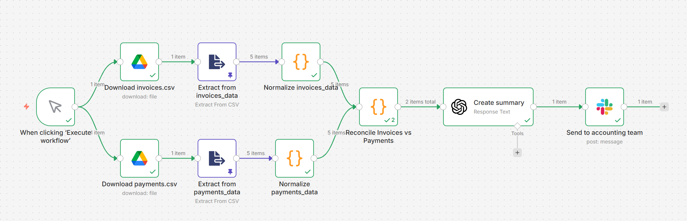

# Automated Invoice–Payment Reconciliation (n8n)

This project demonstrates a demo of an automated finance operations workflow built with **n8n**.  
It reconciles invoices against payments using conservative, audit-friendly rules and isolates only risky cases for human review.

The workflow reflects how automation and AI can be safely applied in finance and accounting contexts.

## Business Problem

Invoice–payment reconciliation is a recurring task in finance teams that is often handled manually.
Accountants must cross-check invoices against bank payments, investigate discrepancies, and prepare exception reports.

## Workflow Overview

The workflow is implemented in **n8n** and follows a clear, modular pipeline:

1. Load invoice and payment data (CSV files).
2. Normalize amounts, currencies, and dates.
3. Reconcile invoices against payments using deterministic rules.
4. Classify and isolate exceptions.
5. Generate a concise summary for the accounting team if there are exceptions.
6. Record the matched invoices and the exceptions on the corresponding excel sheet. 

Only exceptions require human attention; all clean matches are handled automatically.

## Reconciliation Logic (Deterministic)

The core matching logic is intentionally conservative for demo purposes.

### Matching rules
An invoice is matched to a payment only if **all** conditions are satisfied:

- **Same client** (`client_id`)
- **Same currency**
- **Amount tolerance or payment reference includes the invoice ID:** `|payment_amount - invoice_total| ≤ 0.50`
  - (to allow for small rounding differences or bank fees)
- **Time window:** payment date is within **±120 days** of the invoice date
- **No double counting:** each payment can be used at most once

### Exception classification
If an invoice cannot be matched:

- **OVERDUE_INVOICE**: the due date has passed and the invoice remains unpaid  
- **UNPAID_NOT_DUE**: no matching payment yet, but due date has not passed

After all invoices are processed, any remaining unmatched payments are classified as:

- **ORPHAN_PAYMENT**: payment received without a corresponding invoice match
  - (e.g., missing reference, wrong client ID, or timing mismatch)

